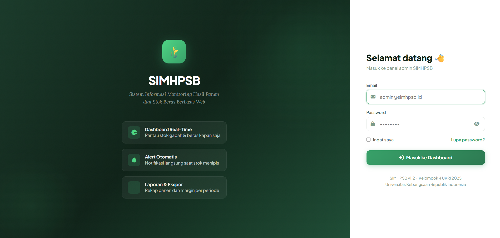

<div align="center">


# 🌾 SIMHPSB
### Sistem Informasi Monitoring Hasil Panen dan Stok Beras Berbasis Web & Mobile

*Tugas Besar Rekayasa Sistem Informasi — Kelas-A1 Kelompok 4*  
*Program Studi Sistem Informasi — Universitas Kebangsaan Republik Indonesia (UKRI) 2025*

</div>

---

## 📌 Tentang Proyek

**SIMHPSB** adalah sistem informasi berbasis web dan mobile yang dirancang untuk membantu pengelola gudang penggilingan padi dalam:

- Memantau stok gabah dan beras secara **real-time**
- Mencatat hasil panen dengan **konversi otomatis** gabah → beras (default 61,5%)
- Mengelola distribusi ke pelanggan tetap (MBG, toko mitra)
- Mendapatkan **alert otomatis** saat stok mendekati batas minimum yang dikonfigurasi
- Menghitung **HPP & margin keuntungan** secara otomatis
- Menghasilkan **laporan periodik** yang bisa diekspor ke PDF & Excel
- Integrasi dengan **n8n workflow automation** untuk notifikasi otomatis

> Sistem ini dikembangkan berdasarkan hasil observasi lapangan pada gudang penggilingan padi milik **Silvy Halimatusyadiah** di Desa Gunung Manik, Kecamatan Talaga, Kabupaten Majalengka.

---

## ✨ Fitur Utama

| Fitur | Deskripsi |
|---|---|
| 📊 Dashboard Real-Time | Ringkasan stok, grafik tren panen, alert aktif, kalkulasi margin |
| 🌾 Pencatatan Panen | Input tonase gabah, konversi otomatis ke estimasi beras, validasi input |
| 📦 Stok Gudang | Transaksi masuk/keluar, saldo real-time per gudang, tracking perubahan |
| 🔔 Alert Otomatis | Notifikasi real-time saat stok ≤ batas minimum (konfigurableberas & gabah) |
| 💰 Manajemen Harga | Konfigurasi harga beli gabah, ongkos giling, harga jual, kalkulasi HPP & margin |
| 👨‍🌾 Data Petani | CRUD data petani mitra, lahan (sawah/ladang), kontak & riwayat panen |
| 📋 Laporan | Rekapitulasi panen, stok, distribusi, margin — ekspor PDF & Excel |
| 📱 Mobile App | Aplikasi Flutter untuk petugas lapangan dan petani monitoring panen dari lokasi |
| 🔐 Autentikasi | JWT Token-based authentication, session management, role-based access |
| 🔄 Sinkronisasi | Real-time data sync antara web dan mobile app via REST API |

---

## 🛠️ Teknologi & Stack

### Backend
- **Laravel 12.x** — REST API Framework (No HTML rendering, pure JSON)
- **MySQL 8.0** — Relational Database Management System
- **JWT (JSON Web Token)** — Token-based authentication (TTL: 8 jam, Refresh: 20160 jam)
- **Redis 7** — In-memory cache & queue management
- **HS256** — JWT Algorithm untuk signing tokens

### Frontend Web
- **HTML5 / CSS3 / JavaScript** — UI Components
- **Blade Templating** — Dynamic template rendering
- **Bootstrap / Tailwind CSS** — Responsive design

### Mobile
- **Flutter 3.x** — Cross-platform mobile framework
- **Dart 3.x** — Programming language
- **Dio** — HTTP client dengan interceptor
- **SharedPreferences** — Local data storage untuk JWT tokens
- **flutter_secure_storage** — Secure credential storage

### Infrastructure & DevOps
- **Docker** — Containerization
- **Docker Compose** — Multi-container orchestration
- **Nginx** — Reverse proxy & load balancing
- **n8n** — Workflow automation & AI agent integration
- **phpMyAdmin** — Database management interface

---

## 📁 Struktur Repository

```
SIMHPSB-Kelompok4/
├── pangan_web/                           # Laravel 12 REST API Backend
│   ├── app/
│   │   ├── Http/Controllers/
│   │   │   ├── Api/
│   │   │   │   ├── AuthController.php           # JWT Authentication
│   │   │   │   ├── PetaniController.php         # Farmer Management (CRUD)
│   │   │   │   ├── LahanController.php          # Land/Field Management
│   │   │   │   ├── PanenController.php          # Harvest Recording
│   │   │   │   ├── StokController.php           # Inventory Management
│   │   │   │   ├── HargaController.php          # Price Configuration
│   │   │   │   ├── AlertController.php          # Stock Alerts
│   │   │   │   ├── DistribusiController.php     # Distribution Management
│   │   │   │   ├── LaporanController.php        # Reports & Analytics
│   │   │   │   └── PetaniProfileController.php  # Farmer Profile (Mobile)
│   │   │   └── Admin/
│   │   ├── Models/
│   │   │   ├── User.php                  # User accounts
│   │   │   ├── Petani.php                # Farmers
│   │   │   ├── Lahan.php                 # Land/Fields
│   │   │   ├── Panen.php                 # Harvest records
│   │   │   ├── Stok.php                  # Inventory
│   │   │   ├── Gudang.php                # Warehouse
│   │   │   ├── Harga.php                 # Prices
│   │   │   ├── Alert.php                 # Alerts
│   │   │   ├── AlertConfiguration.php    # Alert thresholds
│   │   │   └── Distribusi.php            # Distribution
│   │   ├── Services/                     # Business logic
│   │   └── Traits/
│   ├── routes/
│   │   ├── api.php                       # API Routes (Protected by auth:api)
│   │   └── web.php                       # Web Routes (if needed)
│   ├── database/
│   │   ├── migrations/                   # Schema creation scripts
│   │   └── seeders/                      # Sample data seeds
│   ├── storage/                          # File storage
│   ├── tests/                            # PHPUnit test cases
│   ├── Dockerfile                        # Laravel container image
│   ├── docker-compose.yml                # Full stack orchestration
│   ├── .env.example                      # Environment template
│   ├── .env.docker                       # Docker-specific config
│   ├── simhpsb_db.sql                    # Database dump with seed data
│   ├── DOCKER.md                         # Detailed Docker guide
│   ├── artisan                           # Laravel CLI tool
│   ├── composer.json                     # PHP dependencies
│   └── phpunit.xml                       # Test configuration
│
├── pangan_mobile/                        # Flutter Mobile App (Android)
│   ├── lib/
│   │   ├── main.dart                     # App entry point
│   │   ├── main_shell.dart               # Shell routing
│   │   ├── main_patch.dart               # Patched version
│   │   ├── screens/                      # UI Pages
│   │   │   ├── beranda_screen.dart       # Home/Dashboard
│   │   │   ├── login_screen.dart         # Authentication
│   │   │   ├── petani_screen.dart        # Farmer list
│   │   │   ├── stok_gudang_screen.dart   # Inventory
│   │   │   ├── input_panen_screen.dart   # Harvest input
│   │   │   └── data_petani_screen.dart   # Farmer data
│   │   ├── services/
│   │   │   ├── auth_service.dart         # JWT authentication
│   │   │   ├── api_service.dart          # HTTP client with token refresh
│   │   │   └── storage_service.dart      # Local storage
│   │   ├── models/                       # Data models
│   │   ├── widgets/                      # Reusable UI components
│   │   ├── core/                         # Constants & utilities
│   │   └── constants/
│   ├── android/
│   │   ├── app/src/                      # Android-specific code
│   │   ├── build.gradle.kts
│   │   └── gradle.properties
│   ├── ios/                              # iOS support (optional)
│   ├── test/                             # Unit & widget tests
│   ├── pubspec.yaml                      # Flutter dependencies
│   ├── pubspec.lock                      # Dependency lock file
│   └── README.md                         # Mobile app documentation
│
├── Diagram/                              # System Architecture Diagrams
│   ├── ERD.drawio.xml                    # Entity Relationship Diagram (Database Schema)
│   ├── Class Diagram.drawio.xml          # OOP Class Structure
│   ├── Use Case Diagram.drawio.xml       # User interactions & workflows
│   ├── Component Diagram.drawio.xml      # System components & interfaces
│   ├── Deployment Diagram.drawio.xml     # Infrastructure & deployment
│   ├── Aktivity Diagram.drawio.xml       # Process flows
│   └── SequenceDiagram*.xml              # API communication sequences
│
├── docs/                                 # Documentation & Guides
│   ├── testing/                          # Test Case Specifications
│   │   ├── test-case-harga-hpp.md        # Price & HPP calculation tests
│   │   ├── test-case-alert-stok.md       # Alert trigger tests
│   │   └── test-case-petani-lahan.md     # Data management tests
│   ├── screenshots/                      # Application screenshots
│   ├── API.md                            # API endpoint documentation
│   └── USER_GUIDE.md                     # End-user manual
│
├── GITHUB_ISSUES.md                      # Issue tracking & task management
├── TECH_STACK.md                         # Detailed technology stack info
├── README.md                              # Main documentation (this file)
└── simhpsb_db.sql                        # Master database backup
```

---

## 📸 Screenshot Aplikasi

### Web Dashboard

*Halaman login dengan validasi JWT authentication*

### Mobile App
Aplikasi Flutter untuk monitoring real-time dari lapangan oleh petugas dan petani:
- Home dashboard dengan ringkasan stok
- List petani & riwayat panen
- Input pencatatan panen baru
- Monitoring stok gudang

---

## 🚀 Quick Start - Docker Setup

### Prerequisites (Harus Diinstall Dulu)

Verifikasi semua sudah terinstall:
```cmd
docker --version
docker compose version
git --version
```

**Download jika belum ada:**
- Docker Desktop: https://www.docker.com/products/docker-desktop
- Git: https://git-scm.com/download/win

---

### Setup (Copy-Paste di Command Prompt / PowerShell)

#### STEP 1: Clone Repository
```cmd
git clone https://github.com/dzikri15/SIMHPSB-Kelompok4.git
cd SIMHPSB-Kelompok4\pangan_web
```

#### STEP 2: Setup Environment
```cmd
copy .env.example .env
```
✅ File `.env` sudah configured untuk Docker (password: `root`)

#### STEP 3: Start Docker Services
```cmd
docker compose down -v
docker compose up -d --build
```
⏳ Tunggu 2-3 menit sampai MySQL & Redis healthy

Cek status:
```cmd
docker compose ps
```

**Semua services harus "Up" atau "healthy"** ✅

#### STEP 4: Clear Cache & Config
```cmd
docker compose exec app php artisan config:clear
docker compose exec app php artisan cache:clear
```

✅ **SELESAI! Aplikasi sudah siap diakses.**

---

## 🌐 Akses Aplikasi

| Service | URL | Username | Password |
|---------|-----|----------|----------|
| **Web App** | http://localhost:8000 | petugas@simhpsb.com | password |
| **API Docs** | http://localhost:8000/api/doc | - | - |
| **phpMyAdmin** | http://localhost:8080 | root | root |
| **n8n Automation** | http://localhost:5678 | admin | simhpsb123 |

---

## 🔐 Testing API Endpoints

### 1. Login & Get JWT Token
```cmd
curl -X POST http://localhost:8000/api/auth/login ^
  -H "Content-Type: application/json" ^
  -d "{\"email\":\"petugas@simhpsb.com\",\"password\":\"password\"}"
```

Response example:
```json
{
  "access_token": "eyJ0eXAiOiJKV1QiLCJhbGciOiJIUzI1NiJ9...",
  "token_type": "bearer",
  "expires_in": 28800
}
```

### 2. Get Dashboard Summary
```cmd
curl -X GET http://localhost:8000/api/stok/summary ^
  -H "Authorization: Bearer YOUR_TOKEN_HERE"
```

### 3. List Petani (Farmers)
```cmd
curl -X GET "http://localhost:8000/api/petani?per_page=10" ^
  -H "Authorization: Bearer YOUR_TOKEN_HERE"
```

### 4. Get Alert Minimum
```cmd
curl -X GET http://localhost:8000/api/alert/minimum ^
  -H "Authorization: Bearer YOUR_TOKEN_HERE"
```

---

## 📋 API Endpoints Reference

### Authentication
- `POST /api/auth/register` — Create new user account
- `POST /api/auth/login` — Login & get JWT token
- `POST /api/auth/logout` — Logout & invalidate token
- `GET /api/auth/me` — Get current user info
- `POST /api/auth/refresh` — Refresh expired token

### Petani (Farmers)
- `GET /api/petani` — List all farmers (paginated)
- `POST /api/petani` — Create new farmer
- `GET /api/petani/{id}` — Get farmer details
- `PUT /api/petani/{id}` — Update farmer
- `DELETE /api/petani/{id}` — Delete farmer

### Panen (Harvest)
- `GET /api/panen` — List harvest records
- `POST /api/panen` — Create harvest record
- `GET /api/panen/{id}` — Get harvest details
- `PUT /api/panen/{id}` — Update harvest
- `DELETE /api/panen/{id}` — Delete harvest

### Stok (Inventory)
- `GET /api/stok` — List all stock entries
- `GET /api/stok/summary` — Dashboard summary (total stok per komoditas)
- `GET /api/stok/monitoring` — Monitoring per warehouse
- `GET /api/stok/transaksi` — List mutations/transactions
- `POST /api/stok/catat` — Record stok in/out transaction
- `PUT /api/stok/{id}` — Update stok entry
- `DELETE /api/stok/{id}` — Delete stok entry

### Harga (Prices)
- `GET /api/harga` — List prices
- `POST /api/harga/calculate` — Calculate HPP & margin
- `POST /api/harga` — Create price config
- `PUT /api/harga/{id}` — Update price

### Alerts
- `GET /api/alert` — List all alerts
- `GET /api/alert/minimum` — Alerts with stok below minimum
- `GET /api/alert/konfigurasi` — Get alert thresholds
- `PUT /api/alert/konfigurasi` — Update alert thresholds
- `POST /api/alert/{id}/handle` — Mark alert as handled

### Reports
- `GET /api/laporan/panen` — Harvest report
- `GET /api/laporan/stok` — Inventory report
- `GET /api/laporan/margin` — Profit margin report

### Distribusi (Distribution)
- `GET /api/distribusi` — List distributions
- `POST /api/distribusi` — Create distribution record
- `PUT /api/distribusi/{id}` — Update distribution
- `DELETE /api/distribusi/{id}` — Delete distribution

---

## 📱 Mobile App Setup

### Prerequisites
- Flutter SDK: https://flutter.dev/docs/get-started/install
- Android Studio or VS Code + Dart extension
- Android Emulator or Physical Android device

### Run Mobile App
```bash
cd pangan_mobile

# Install dependencies
flutter pub get

# Run on connected device/emulator
flutter run

# Or specify device
flutter run -d emulator-5554
```

### Configure API Endpoint
Edit `lib/services/api_service.dart`:
```dart
class AppConstants {
  // Change IP/URL based on your environment
  static const String baseUrl = 'http://192.168.1.100:8000/api';  
}
```

**Note:** Use `192.168.x.x` for emulator (localhost tidak work), use `localhost:8000` untuk physical device yg terhubung via USB.

---

## 🛑 Container Management Commands

### View Services Status
```cmd
docker compose ps
```

### Stop All Services (data tetap)
```cmd
docker compose stop
```

### Start Services
```cmd
docker compose start
```

### Restart Services
```cmd
docker compose restart
```

### View Logs
```cmd
docker compose logs              # All services
docker compose logs -f app       # Laravel (follow mode)
docker compose logs db           # MySQL only
docker compose logs redis        # Redis only
```

### Enter Container Terminal
```cmd
docker compose exec app bash     # Laravel container
docker compose exec db bash      # MySQL container
```

### Remove Everything (WARNING: Data lost!)
```cmd
docker compose down -v           # Remove containers, networks, volumes
```

---

## 🔧 Troubleshooting Guide

### MySQL Connection Failed
```cmd
# Check MySQL logs
docker compose logs db

# Restart MySQL
docker compose restart db

# Wait for healthy status
docker compose ps
```

### Cache/Config Errors
```cmd
docker compose exec app php artisan cache:clear
docker compose exec app php artisan config:clear
```

### Port Already in Use
Edit `docker-compose.yml` dan ubah port:
```yaml
ports:
  - "9000:8000"  # Changed from 8000
```
Restart: `docker compose restart app`

### Rebuild Images (After changing Dockerfile)
```cmd
docker compose up -d --build
```

### Reset Database
```cmd
docker compose exec db mysql -uroot -proot -e "DROP DATABASE simhpsb_db; CREATE DATABASE simhpsb_db;"
```

---

## 📚 Documentation

- **[Docker Setup Guide](./pangan_web/DOCKER.md)** — Detailed Docker instructions
- **[API Documentation](./pangan_web/routes/api.php)** — All API routes
- **[Database Schema](./Diagram/ERD.drawio.xml)** — Entity Relationship Diagram
- **[Test Cases](./docs/testing/)** — QA test specifications
- **[Technology Stack](./TECH_STACK.md)** — Detailed tech info

---

## 👥 Tim Pengembang

**Kelompok 4 - Sistem Informasi UKRI 2025**

| # | Nama | GitHub | Peran utama | Catatan / Tanggung jawab |
|---|------|--------|-------------|-------------------------|
| 1️⃣ | Muhammad Dzikri Sagara | [@dzikri15](https://github.com/dzikri15) | Project Manager (PM) · Backend · DevOps (Docker setup) | Arsitektur backend, API design, sprint planning, dan bertanggung jawab atas setup Docker & containerization (hanya bagian Docker). |
| 2️⃣ | Fahri Noah Mikhailovna | [@NoahMikhailovna](https://github.com/NoahMikhailovna) | Frontend Web · Mobile (Flutter) | UI/UX frontend web, integrasi dengan API, kontribusi pada aplikasi Flutter. |
| 3️⃣ | Alamsyah | [@L-6969](https://github.com/L-6969) | Diagram · QA Web · Manual Book Web · DevOps | Membantu desain diagram, QA untuk web, dokumentasi manual web, dan berperan di DevOps (n8n workflows & infra). |
| 4️⃣ | Difa Anisa | [@difanisa](https://github.com/difanisa) | Diagram · QA Web · Manual Book Web | Mendesain diagram sistem, melakukan QA web, menulis manual web. |
| 5️⃣ | Devina | [@ayoel99](https://github.com/ayoel99) | Diagram · QA Mobile · Manual Book Mobile | Mendesain diagram, QA mobile, menyusun panduan pengguna mobile. |
| 6️⃣ | Agusta Firman Firdaus | [@AgustaFirmanFirdaus](https://github.com/AgustaFirmanFirdaus) | QA Mobile · Manual Book Mobile · Testing | Pengujian aplikasi mobile, pembuatan dokumentasi manual mobile, pelaksanaan testing |


---

## 📊 Project Progress & Milestones

### Backend & Infrastructure ✅
- ✅ Backend API (Laravel 12) — **Production Ready**
- ✅ Database Schema & Migrations — **Completed**
- ✅ Docker Containerization — **Completed**
- ✅ JWT Authentication — **Implemented**
- ✅ Core Features (Stok, Panen, Alert) — **Implemented**
- ✅ API Documentation — **Completed**
- ✅ Redis Caching & Queue — **Integrated**
- ✅ n8n Automation Setup — **Done** 

### Frontend & Mobile ✅
- ✅ Mobile App (Flutter) — **Completed**
- ✅ Frontend Web UI — **Completed**
- ✅ Dashboard & Reports — **Completed**

### DevOps & Automation 📅
- 📅 Stok Alert Workflow (#113) — **Todo**
- 📅 AI Agent n8n Workflow (#114) — **Todo**
- 📅 Testing Workflow (#115) — **Todo**
- 📅 Dokumentasi Workflow — **Todo**
- 📅 Full Workflow Testing — **Todo**

### Quality & Documentation 📚
- 📅 Testing & QA — **Ongoing**
- 📅 Deployment & CI/CD — **Final Phase**
- 📅 Complete Documentation — **In Progress**

**Overall Progress: 80% Complete** 📈

---

## 📄 License

MIT License — See [LICENSE](./LICENSE) file for details.

---

## 🤝 Contributing

Untuk berkontribusi:
1. Fork repository
2. Create feature branch (`git checkout -b feature/amazing-feature`)
3. Commit changes (`git commit -m 'Add amazing feature'`)
4. Push to branch (`git push origin feature/amazing-feature`)
5. Open Pull Request

---

## 📞 Support & Contact

- **GitHub Issues:** https://github.com/dzikri15/SIMHPSB-Kelompok4/issues
- **Project Manager:** Dzikri
- **Status:** 🟢 Active Development

---

## 🚀 DevOps & Automation (Sprint 3)

### N8N Workflows Setup
Automasi n8n sekarang fokus pada dua workflow utama yang dibutuhkan:

- **Stok Alert Workflow** — monitoring otomatis tiap jam untuk alert stok minimum
- **AI Agent Workflow** — integrasi Google Gemini LLM untuk fitur AI/LLM

📖 **Lihat:** [DEVOPS_N8N_README.md](./DEVOPS_N8N_README.md) untuk setup lengkap

---

## 📈 Statistik Proyek

| Metrik | Value |
|--------|-------|
| Total Lines of Code | ~15,000+ |
| API Endpoints | 40+ |
| Database Tables | 12 |
| Test Cases | 50+ |
| Deployment Environments | 2 (Dev, Docker) |
| Team Size | 6 |
| Sprint Duration | 2 weeks |
| Current Sprint | Sprint 3 |

---

## ✨ Key Achievements

🏆 **Sprint 1-2 Completed:**
- Backend API fully functional
- Docker containerization complete
- Database schema & relationships optimized
- JWT authentication implemented
- Alert system working
- API documentation 100%

🎯 **Sprint 3 (Current):**
- n8n automation framework setup
- Workflow design & implementation
- Mobile app development
- Web UI refinement

🔮 **Sprint 4 (Upcoming):**
- Full system testing
- Performance optimization
- Production deployment
- User training & documentation

---

**Last Updated:** 30 May 2026  
**Version:** 1.3  
**Status:** 🟢 Production Ready (Backend & Frontend/Mobile), 🟡 In Development (DevOps)  
**License:** MIT  
**Repository:** https://github.com/dzikri15/SIMHPSB-Kelompok4
