<div align="center">


<br /><br />

# 🌾 SIMHP
### Sistem Informasi Monitoring Hasil Panen Berbasis Web & Mobile

**Tugas Besar Rekayasa Sistem Informasi — Kelas A1 · Kelompok 4**
*Program Studi Sistem Informasi — Universitas Kebangsaan Republik Indonesia (UKRI) 2026*

[](https://simhp.my.id)
[](https://simhp.my.id)
[](./SRS_SIMHP_v3_0_Kelompok4.docx)

</div>

---

## 📋 Daftar Isi

- [Tentang Proyek](#-tentang-proyek)
- [Latar Belakang](#-latar-belakang)
- [Fitur Utama](#-fitur-utama)
- [Tampilan Aplikasi](#-tampilan-aplikasi)
  - [Web Application](#-web-application)
  - [Mobile Application](#-mobile-application)
- [Cara Penggunaan](#-cara-penggunaan)
  - [Penggunaan Web (Admin & Petugas)](#penggunaan-web-admin--petugas)
  - [Penggunaan Mobile (Petugas & Petani)](#penggunaan-mobile-petugas--petani)
- [Infrastruktur & Arsitektur](#️-infrastruktur--arsitektur)
- [Teknologi & Stack](#️-teknologi--stack)
- [Struktur Repository](#-struktur-repository)
- [Instalasi & Setup](#-instalasi--setup)
  - [Web (Docker)](#-instalasi-web-via-docker)
  - [Mobile (Flutter)](#-instalasi-mobile-flutter)
- [API Reference](#-api-reference)
- [Tim Pengembang](#-tim-pengembang)
- [Statistik Proyek](#-statistik-proyek)

---

## 📌 Tentang Proyek

**SIMHP** *(Sistem Informasi Monitoring Hasil Panen)* adalah platform digital terintegrasi berbasis **Web dan Mobile** yang dirancang khusus untuk mendukung pengelolaan hasil panen padi secara terdigitalisasi dan terpusat.

Sistem ini memungkinkan pengelola gudang penggilingan padi untuk:

- 📊 Memantau **stok gabah dan beras** secara **real-time**
- 📝 Mencatat hasil panen beserta **foto bukti** dan **snapshot harga gabah/kg**
- 📦 Mengelola **transaksi masuk/keluar** stok gudang secara transparan
- 🚚 Mengelola **distribusi** ke pelanggan tetap (MBG, toko mitra)
- 🔔 Mendapatkan **alert otomatis** saat stok mendekati batas minimum yang dikonfigurasi
- 📋 Menghasilkan **laporan panen & stok** yang bisa diekspor ke PDF & Excel
- 🤖 Memanfaatkan **Chatbot AI HPSBBot** berbasis Groq API untuk tanya-jawab stok & harga

---

## 📖 Latar Belakang

> *"Banyak penggilingan padi masih mencatat hasil panen secara manual di buku tulis, yang rentan terhadap kesalahan, kehilangan data, dan keterlambatan pelaporan."*

Sistem ini dikembangkan berdasarkan hasil **observasi lapangan** pada gudang penggilingan padi milik **Silvy Halimatusyadiah** di Desa Gunung Manik, Kecamatan Talaga, Kabupaten Majalengka. Permasalahan utama yang ditemukan:

| Masalah | Dampak |
|---------|--------|
| Pencatatan panen manual di buku | Rentan hilang/rusak, tidak bisa diakses jarak jauh |
| Tidak ada monitoring stok real-time | Kehabisan beras tanpa pemberitahuan sebelumnya |
| Tidak ada jejak harga historis | Sulit analisis margin keuntungan per periode |
| Laporan dibuat manual setiap bulan | Memakan waktu, potensi kesalahan perhitungan |
| Komunikasi petani-pengelola manual | Petani tidak tahu harga gabah terkini |

**Solusi:** SIMHP hadir sebagai sistem informasi terintegrasi yang menggantikan proses manual tersebut dengan platform digital yang mudah digunakan.

---

## ✨ Fitur Utama

### 🌐 Platform Web (Admin & Petugas)

| # | Fitur | Deskripsi |
|---|-------|-----------|
| 1 | 📊 **Dashboard Real-Time** | Ringkasan stok gabah & beras, grafik tren panen 6 bulan, target pasar vs realisasi, alert aktif, harga gabah terkini |
| 2 | 🌾 **Pencatatan Panen** | Input hasil gabah + foto bukti wajib, snapshot harga otomatis, gabah langsung masuk stok gudang |
| 3 | 📦 **Stok Gudang** | Transaksi masuk/keluar (foto bukti wajib), saldo real-time, beras input manual setelah giling, riwayat lengkap |
| 4 | 🔔 **Alert Otomatis** | Notifikasi banner merah saat stok ≤ batas minimum (konfigurasi terpisah untuk beras & gabah), mark as handled |
| 5 | 💰 **Manajemen Harga** | Konfigurasi harga beli gabah per kg & harga jual beras per kg, riwayat perubahan harga |
| 6 | 👨‍🌾 **Data Petani** | CRUD data petani mitra, data lahan, kontak, riwayat panen & total penghasilan gabah |
| 7 | 📋 **Laporan** | Rekapitulasi panen & stok per periode — ekspor PDF & Excel |
| 8 | 📍 **Tujuan Distribusi** | Manajemen daftar lokasi pengiriman (MBG, toko mitra) |
| 9 | 🤖 **Chatbot HPSBBot** | Asisten AI berbasis Groq + Llama 3.3 70B, tanya stok & harga real-time |
| 10 | ⚙️ **Pengaturan Sistem** | Konfigurasi batas minimum alert, manajemen pengguna (Admin only) |

### 📱 Platform Mobile (Petugas & Petani)

| # | Fitur | Deskripsi |
|---|-------|-----------|
| 1 | 🏠 **Beranda** | Dashboard ringkasan stok, aktivitas terakhir, harga gabah terkini |
| 2 | 🌾 **Panen** | Catat hasil panen dari lapangan + upload foto bukti |
| 3 | 📦 **Gudang** | Lihat saldo stok, catat transaksi masuk/keluar, upload foto bukti |
| 4 | 📍 **Distribusi** | Daftar tujuan distribusi aktif |
| 5 | 👤 **Profil Petani** | Data diri, riwayat panen, summary penghasilan gabah (khusus role Petani) |
| 6 | 🤖 **HPSBBot Mobile** | Chatbot AI tersedia di semua halaman via floating button |
| 7 | 🔐 **Autentikasi** | Login, daftar akun (petani), JWT token management otomatis |

### 🔒 Hak Akses Per Role

| Fitur | Admin | Petugas | Petani |
|-------|:-----:|:-------:|:------:|
| Dashboard lengkap | ✅ | ✅ | ❌ |
| Pencatatan Panen | ✅ | ✅ | ❌ |
| Stok Gudang | ✅ | ✅ | ❌ |
| Tujuan Distribusi | ✅ | ✅ | ❌ |
| Chatbot HPSBBot | ✅ | ✅ | ❌ |
| Manajemen Pengguna | ✅ | ❌ | ❌ |
| Konfigurasi Alert | ✅ | ❌ | ❌ |
| Dashboard Petani (web) | ❌ | ❌ | ✅ |
| Profil & Riwayat Panen (mobile) | ❌ | ❌ | ✅ |

---

## 📸 Tampilan Aplikasi

### 🌐 Web Application

#### Halaman Landing & Login

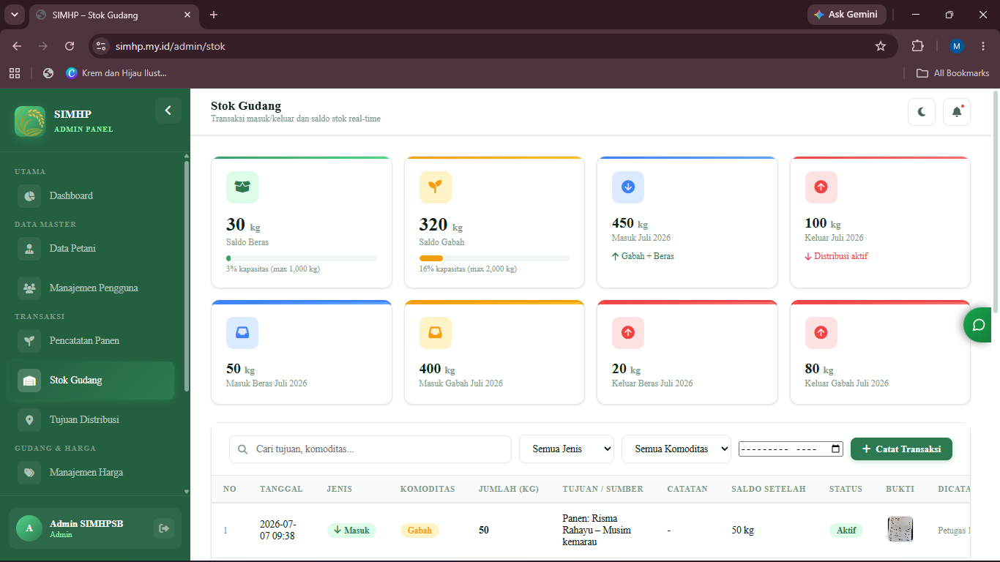
*Halaman stok gudang — monitoring saldo gabah & beras dengan riwayat transaksi*

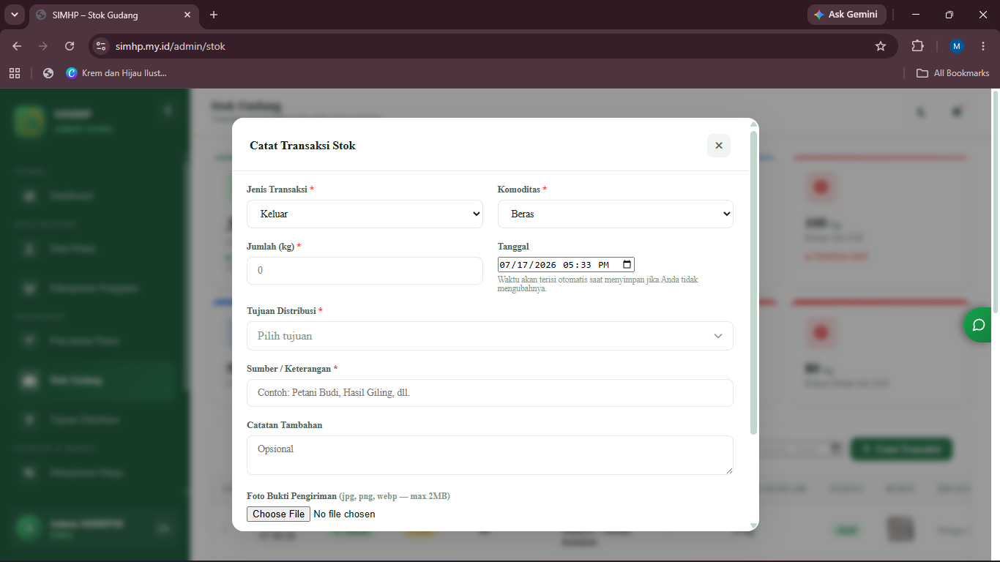
*Detail transaksi stok — riwayat masuk/keluar disertai foto bukti*

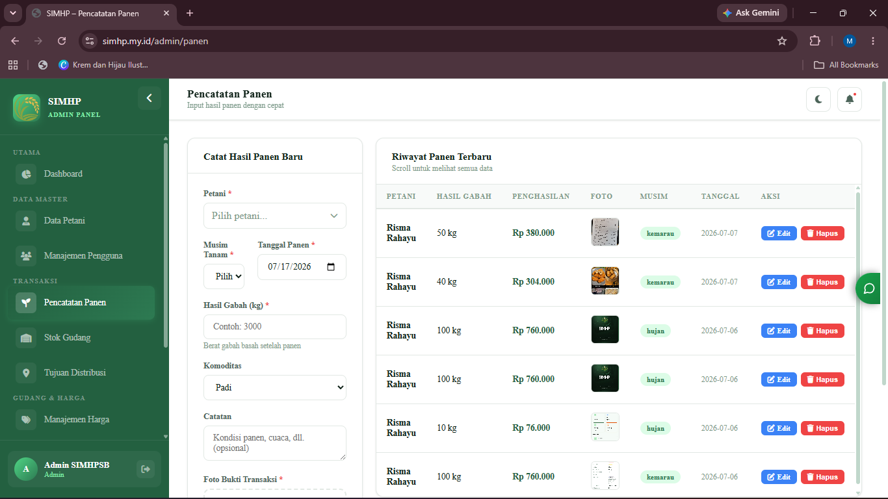
*Pencatatan panen — form input dengan upload foto bukti wajib*

---

#### Data Petani & Manajemen Pengguna

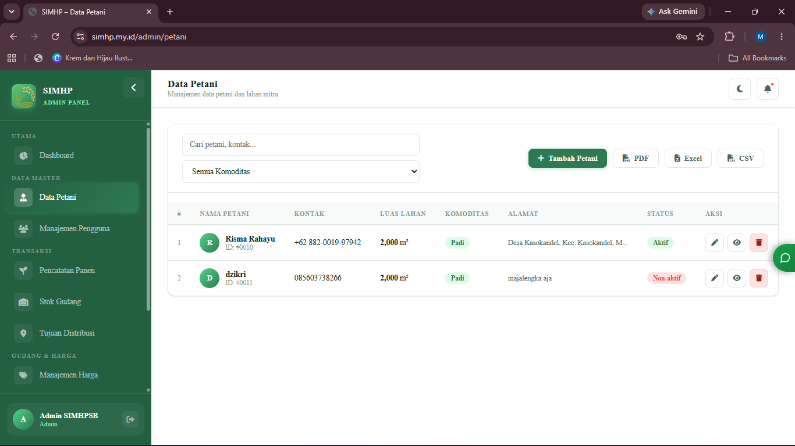
*Data Petani — daftar petani mitra dan informasi kontak*

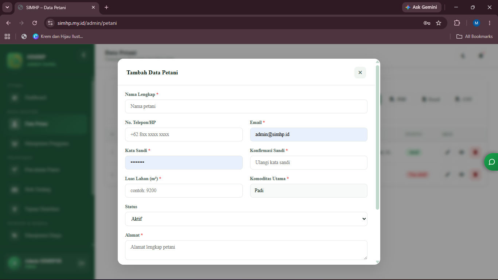
*Detail Petani — riwayat panen dan total penghasilan gabah petani*

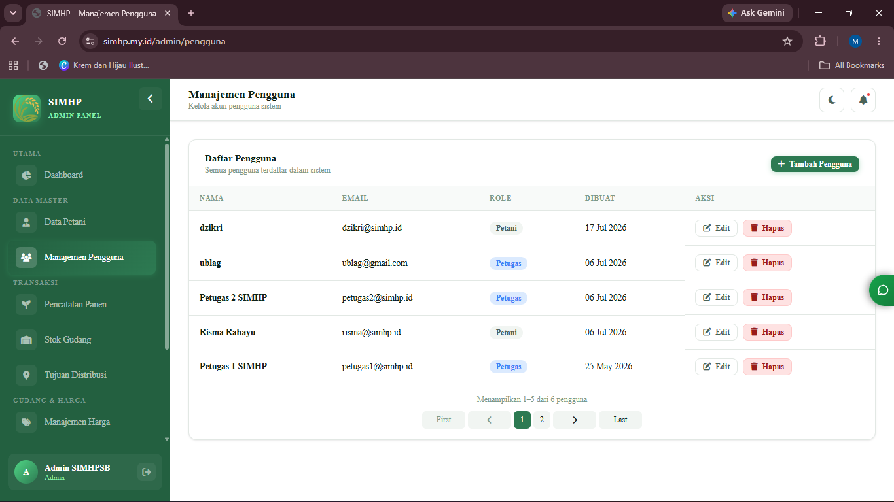
*Manajemen Pengguna — daftar akun aplikasi (Admin, Petugas, Petani)*

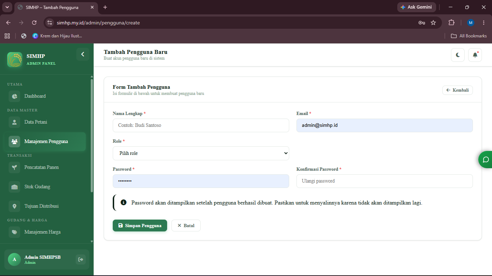
*Manajemen Pengguna — form tambah/edit hak akses pengguna*

---

#### Alert, Laporan & Fitur Lainnya

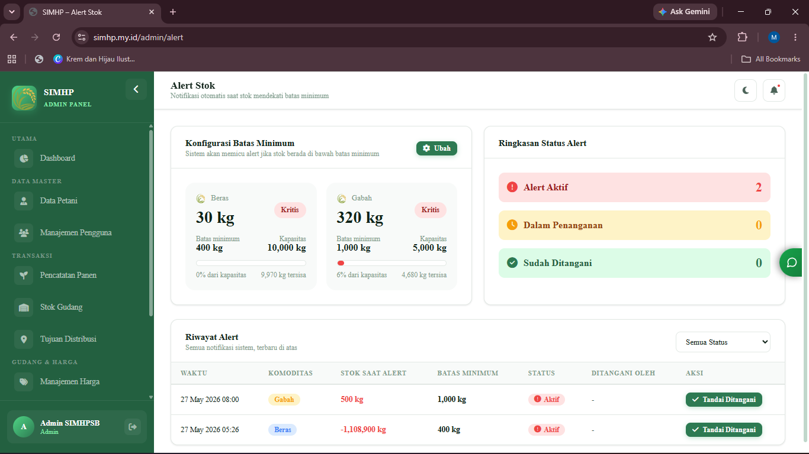
*Halaman alert — daftar peringatan stok dengan status dan tombol "Tandai Ditangani"*

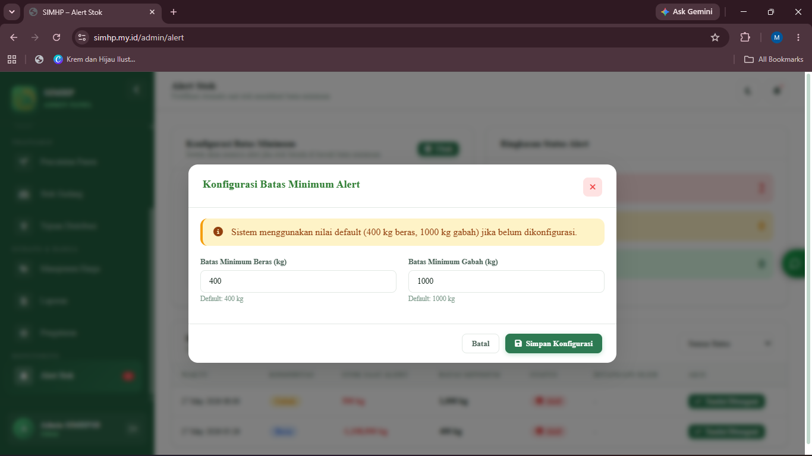
*Konfigurasi batas minimum alert untuk gabah dan beras*

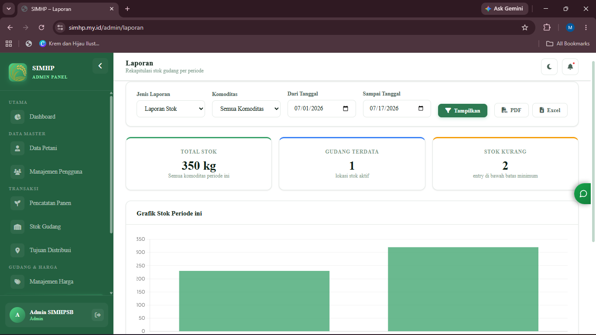
*Laporan rekapitulasi panen per periode*

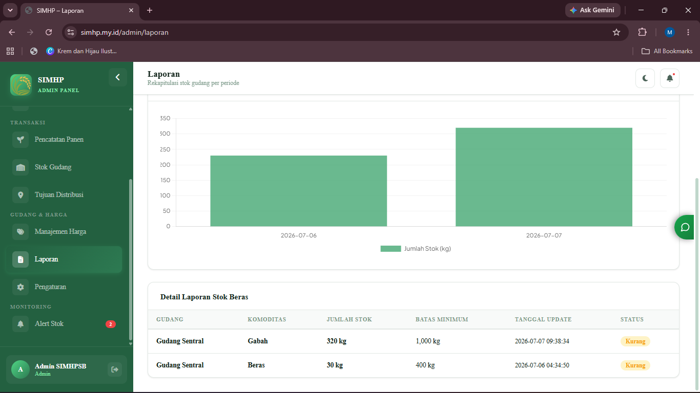
*Laporan stok dengan opsi ekspor PDF & Excel*

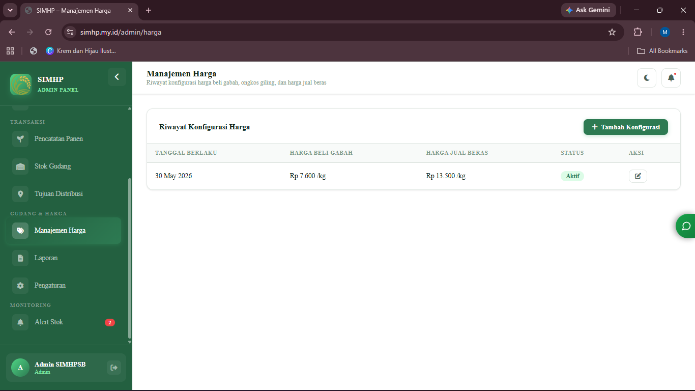
*Konfigurasi harga gabah dan beras*
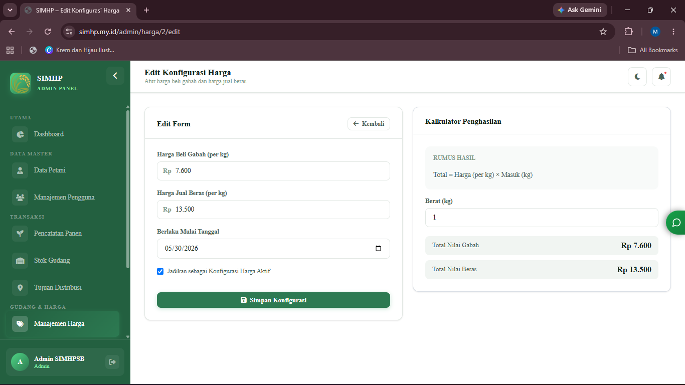
*snapshot harga*

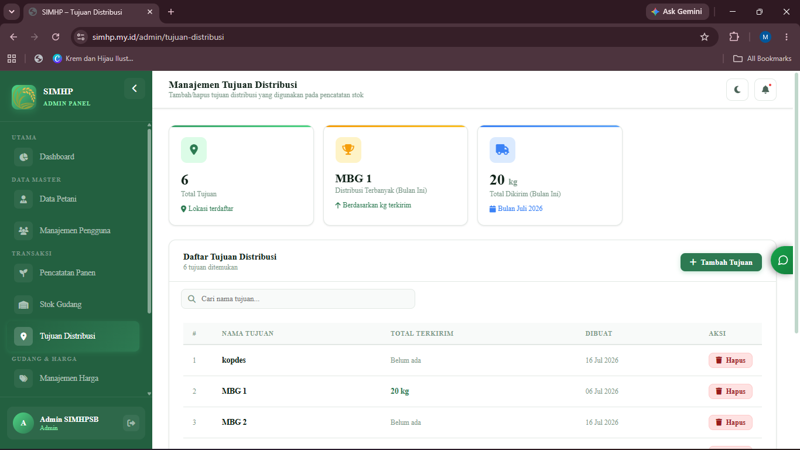
*Manajemen tujuan distribusi*

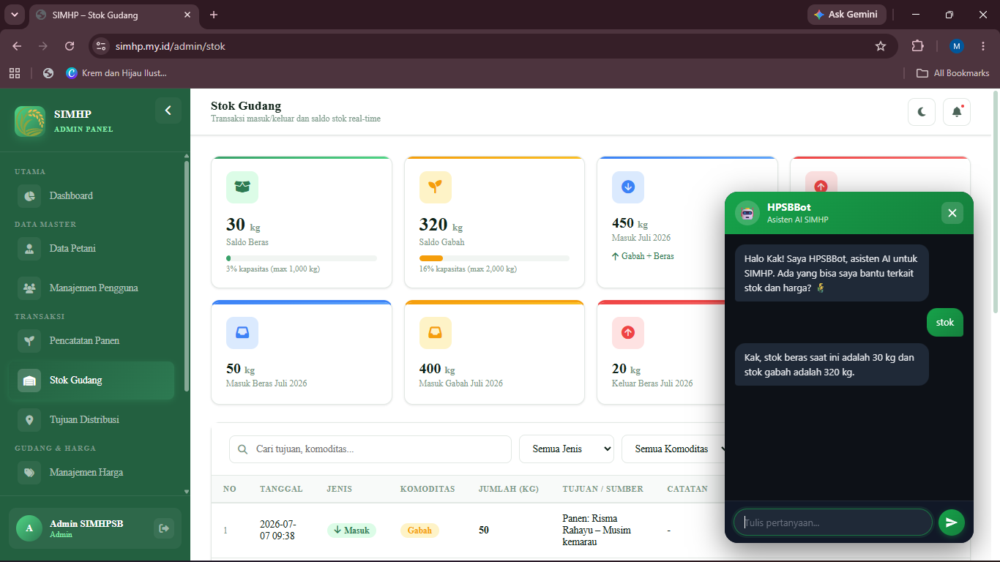
*HPSBBot — Chatbot AI terintegrasi Groq API untuk tanya stok & harga*

---

### 📱 Mobile Application

#### Autentikasi

| Login | Daftar Akun (Step 1) | Daftar Akun (Step 2) |
|:-----:|:--------------------:|:--------------------:|
| .jpg) | .jpg) | .jpg) |
| *Halaman login dengan dark mode toggle* | *Daftar akun — isi email & password* | *Data petani — alamat, nomor HP, luas lahan* |

---

#### Beranda & Dashboard Mobile

| Beranda Petugas | Beranda Petani | Notifikasi |
|:--------------:|:--------------:|:----------:|
| .jpg) | .jpg) | .jpg) |
| *Dashboard petugas — ringkasan stok & aktivitas* | *Dashboard petani — harga gabah & riwayat panen* | *Notifikasi alert stok* |

---

#### Panen & Stok Gudang

| Pencatatan Panen | Form Panen | Stok Gudang |
|:---------------:|:----------:|:-----------:|
| .jpg) | .jpg) | .jpg) |
| *Riwayat panen mobile* | *Form catat panen + foto bukti* | *Monitoring stok gudang* |

| Catat Transaksi | Detail Transaksi | Foto Bukti |
|:--------------:|:----------------:|:----------:|
| .jpg) | .jpg) | .jpg) |
| *Dialog catat transaksi stok* | *Detail transaksi* | *Preview foto bukti transaksi* |

---

#### Fitur Lainnya

| Distribusi | Profil Petani | Chatbot Mobile |
|:----------:|:-------------:|:--------------:|
| .jpg) | .jpg) | .jpg) |
| *Daftar tujuan distribusi* | *Profil & riwayat panen petani* | *HPSBBot chatbot di mobile* |

---

## 📖 Cara Penggunaan

### Penggunaan Web (Admin & Petugas)

#### 1. Login ke Sistem
1. Buka browser → akses **https://simhp.my.id** atau **http://localhost** (lokal)
2. Klik **Masuk →** di kanan atas
3. Masukkan **email / username / nama petani** dan **password**
4. Klik **Masuk ke Dashboard**
5. Sistem akan mengarahkan ke panel sesuai role (Admin/Petugas/Petani)

#### 2. Catat Hasil Panen (Admin & Petugas)
1. Klik menu **Pencatatan Panen** di sidebar kiri
2. Klik tombol **+ Tambah Panen**
3. Isi formulir:
   - Pilih **nama petani** dari dropdown
   - Masukkan **jumlah gabah (kg)**
   - Pilih **tanggal panen**
   - Upload **foto bukti panen** (wajib)
4. Klik **Simpan** — gabah otomatis masuk ke stok gudang

#### 3. Catat Transaksi Stok Gudang
1. Klik menu **Stok Gudang**
2. Klik **+ Catat Transaksi**
3. Pilih jenis transaksi: **Masuk** atau **Keluar**
4. Pilih komoditas: **Gabah** atau **Beras**
5. Masukkan jumlah (kg), tujuan (jika keluar), dan upload **foto bukti**
6. Klik **Simpan**

#### 4. Monitor Alert Stok
1. Klik menu **Alert** di sidebar
2. Lihat daftar alert aktif (banner merah muncul otomatis di dashboard)
3. Setelah stok ditangani, klik **Tandai Ditangani** untuk menutup alert
4. Konfigurasi batas minimum: menu **Alert** → tab **Konfigurasi**

#### 5. Generate Laporan
1. Klik menu **Laporan**
2. Pilih **Laporan Panen** atau **Laporan Stok**
3. Tentukan **rentang tanggal**
4. Klik **Ekspor PDF** atau **Ekspor Excel**

#### 6. Gunakan Chatbot HPSBBot
1. Klik ikon chat 💬 di pojok kanan bawah
2. Tanyakan informasi seperti:
   - *"Berapa stok beras saat ini?"*
   - *"Harga gabah hari ini berapa?"*
   - *"Total panen bulan ini?"*
3. AI akan menjawab berdasarkan data real-time dari database

---

### Penggunaan Mobile (Petugas & Petani)

#### Cara Login Mobile
1. Buka aplikasi **SIMHP** di Android
2. Masukkan email dan password
3. Klik **Masuk ke Akun**

#### Cara Daftar Akun (Petani Baru)
1. Klik **Daftar sebagai Petani** di bawah tombol login
2. **Step 1:** Isi nama lengkap, email, password, konfirmasi password → **Lanjut**
3. **Step 2:** Isi alamat, nomor HP (opsional), luas lahan (opsional) → **Daftar Sekarang**
4. Akun akan diverifikasi oleh Admin sebelum bisa digunakan

#### Catat Panen dari Mobile
1. Buka tab **Panen** di bottom navigation
2. Tap **+ Catat Panen**
3. Isi jumlah gabah, tanggal, dan foto bukti
4. Tap **Simpan**

#### Catat Transaksi Stok (Petugas)
1. Buka tab **Gudang**
2. Tap **+ Catat Transaksi**
3. Pilih masuk/keluar, komoditas, jumlah, dan foto bukti
4. Tap **Simpan**

---

## 🏗️ Infrastruktur & Arsitektur

### Arsitektur Sistem

```
┌─────────────────────────────────────────────────────────────┐
│                      CLIENT LAYER                           │
│   ┌──────────────────┐          ┌────────────────────────┐  │
│   │  Web Browser     │          │   Android App (Flutter)│  │
│   │  (Admin/Petugas/ │          │   (Petugas / Petani)   │  │
│   │   Petani)        │          │                        │  │
│   └────────┬─────────┘          └───────────┬────────────┘  │
└────────────┼──────────────────────────────── ┼─────────────┘
             │ HTTPS                           │ HTTPS/REST API
             ▼                                 ▼
┌─────────────────────────────────────────────────────────────┐
│                   SERVER LAYER (VPS/Docker)                 │
│                                                             │
│   ┌─────────────────────────────────────────────────────┐  │
│   │                    Nginx (Port 80/443)               │  │
│   │              Reverse Proxy + Static Files            │  │
│   └──────────────────────┬──────────────────────────────┘  │
│                          │                                  │
│   ┌──────────────────────▼──────────────────────────────┐  │
│   │             Laravel 12 (PHP-FPM)                     │  │
│   │  ┌─────────────────┐  ┌──────────────────────────┐  │  │
│   │  │  Web Routes     │  │  API Routes (/api/*)      │  │  │
│   │  │  (Blade Views)  │  │  JWT Protected           │  │  │
│   │  └─────────────────┘  └──────────────────────────┘  │  │
│   │  ┌─────────────────┐  ┌──────────────────────────┐  │  │
│   │  │  ChatbotCtrl    │  │  Storage (Foto Bukti)    │  │  │
│   │  │  → Groq API     │  │  /storage/app/public/    │  │  │
│   │  └─────────────────┘  └──────────────────────────┘  │  │
│   └─────────────────────────────────────────────────────┘  │
│                                                             │
│   ┌────────────────┐  ┌──────────────┐  ┌───────────────┐  │
│   │   MySQL 8.0    │  │   Redis 7    │  │  phpMyAdmin   │  │
│   │   Port 3306    │  │   Port 6379  │  │  Port 8080    │  │
│   │   (Database)   │  │  (Cache/Queue│  │  (DB Admin)   │  │
│   └────────────────┘  └──────────────┘  └───────────────┘  │
└─────────────────────────────────────────────────────────────┘
             │ HTTP Request + Context Injection
             ▼
┌─────────────────────────────────────────────────────────────┐
│                  GROQ API (External)                        │
│   Model: llama-3.3-70b-versatile                           │
│   Arsitektur: LPU (Language Processing Unit)               │
│   Latency: <1 detik                                         │
└─────────────────────────────────────────────────────────────┘
```

### Docker Services

```
docker-compose.yml
├── app        → Laravel 12 + PHP 8.3-FPM (Port internal)
├── nginx      → Nginx 1.25 (Port 80 → app:9000)
├── db         → MySQL 8.0 (Port 3306)
├── redis      → Redis 7-Alpine (Port 6379)
└── phpmyadmin → phpMyAdmin (Port 8080 → db:3306)
```

### Arsitektur Data Flow

```
[Pengguna Input Data]
        ↓
[Form Validasi (Laravel/Flutter)]
        ↓
[Upload Foto → Storage Public]
        ↓
[Simpan ke MySQL (Transaksi ACID)]
        ↓
[Trigger Alert Check (Redis Cache)]
        ↓
[Update Dashboard Real-Time]
        ↓
[Available via REST API → Mobile]
```

### Skema Database (11 Tabel Utama)

```
users              → Akun pengguna (Admin/Petugas/Petani)
petanis            → Data petani mitra + informasi lahan
lahans             → Data lahan milik petani
panens             → Rekaman hasil panen + foto + snapshot harga
stok_beras         → Transaksi stok gudang (gabah & beras)
konfigurasi_hargas → Harga beli gabah & harga jual beras
alerts             → Alert stok aktif/handled
alert_configurations → Konfigurasi batas minimum per komoditas
tujuan_distribusi  → Daftar lokasi distribusi
personal_access_tokens → Laravel Sanctum tokens
jobs               → Queue jobs (Redis-backed)
```

---

## 🛠️ Teknologi & Stack

### Backend

| Teknologi | Versi | Fungsi |
|-----------|-------|--------|
| **Laravel** | 12.x | Full-stack web framework (Web + REST API) |
| **PHP** | 8.3 | Server-side language |
| **MySQL** | 8.0 | Relational database management |
| **Redis** | 7.x | In-memory cache & queue management |
| **JWT (tymon/jwt-auth)** | Latest | Token-based authentication |
| **HS256** | — | JWT signing algorithm |
| **TTL JWT** | 8 jam / refresh 14 hari | Session management |

### Frontend Web

| Teknologi | Fungsi |
|-----------|--------|
| **Blade Templating** | Server-side rendering |
| **HTML5 / CSS3** | Struktur & styling UI |
| **JavaScript (Vanilla)** | Interaktivitas & AJAX |
| **Custom Dark Mode CSS** | Tema gelap native |
| **Chart.js** | Grafik tren panen & stok |

### Mobile

| Teknologi | Versi | Fungsi |
|-----------|-------|--------|
| **Flutter** | 3.x | Cross-platform mobile framework |
| **Dart** | 3.x | Programming language |
| **http** | Latest | REST API HTTP client |
| **SharedPreferences** | Latest | Simpan JWT token lokal |
| **image_picker** | Latest | Upload foto bukti dari kamera/galeri |

### Infrastructure & DevOps

| Teknologi | Fungsi |
|-----------|--------|
| **Docker** | Containerization semua services |
| **Docker Compose** | Multi-container orchestration |
| **Nginx** | Reverse proxy & static file server |
| **Groq API** | AI inference engine (LPU, latensi rendah) |
| **Llama 3.3 70B** | Model AI chatbot HPSBBot |
| **phpMyAdmin** | Database management GUI |

---

## 📁 Struktur Repository

```
SIMHPSB-Kelompok4/
├── pangan_web/                           # Laravel Backend + Web Admin
│   ├── app/
│   │   ├── Http/Controllers/
│   │   │   ├── Api/
│   │   │   │   ├── AuthController.php           # JWT Authentication
│   │   │   │   ├── PetaniController.php         # Farmer Management (CRUD)
│   │   │   │   ├── LahanController.php          # Land/Field Management
│   │   │   │   ├── PanenController.php          # Harvest Recording
│   │   │   │   ├── StokController.php           # Inventory Management
│   │   │   │   ├── HargaController.php          # Price Configuration
│   │   │   │   ├── AlertController.php          # Stock Alerts
│   │   │   │   ├── TujuanDistribusiController.php # Distribution Targets
│   │   │   │   ├── LaporanController.php        # Reports & Analytics
│   │   │   │   └── PetaniProfileController.php  # Farmer Profile (Mobile)
│   │   │   ├── Admin/                           # Web Admin Controllers
│   │   │   ├── ChatbotController.php            # Proxy ke Groq API
│   │   │   └── PetaniDashboardController.php    # Petani Web Dashboard
│   │   ├── Models/
│   │   │   ├── User.php                  # User accounts
│   │   │   ├── Petani.php                # Farmers
│   │   │   ├── Lahan.php                 # Land/Fields
│   │   │   ├── Panen.php                 # Harvest records
│   │   │   ├── Stok.php                  # Inventory (stok_beras)
│   │   │   ├── KonfigurasiHarga.php      # Price configuration
│   │   │   ├── Alert.php                 # Alerts
│   │   │   ├── AlertConfiguration.php    # Alert thresholds
│   │   │   └── TujuanDistribusi.php      # Distribution targets
│   ├── routes/
│   │   ├── api.php                       # API Routes (Protected by auth:api)
│   │   └── web.php                       # Web Admin Routes
│   ├── database/
│   │   ├── migrations/                   # Schema creation scripts
│   │   └── seeders/                      # Sample data seeds
│   ├── resources/views/
│   │   ├── auth/                         # Login, Intro, About pages
│   │   ├── admin/                        # Web admin pages
│   │   ├── petani/                       # Petani dashboard
│   │   ├── layout/                       # Base layouts
│   │   └── chat-widget.blade.php         # Chatbot HPSBBot widget
│   ├── storage/                          # File storage (foto bukti)
│   ├── Dockerfile                        # Laravel + PHP-FPM container
│   ├── docker-compose.yml                # Full stack orchestration
│   ├── docker-entrypoint.sh              # Container startup script
│   ├── .env.example                      # Environment variables template
│   ├── simhpsb_db.sql                    # Database dump with seed data
│   └── composer.json                     # PHP dependencies
│
├── pangan_mobile/                        # Flutter Mobile App (Android)
│   ├── lib/
│   │   ├── main.dart                     # App entry point
│   │   ├── main_shell.dart               # Shell routing + Chatbot widget
│   │   ├── screens/
│   │   │   ├── beranda_screen.dart       # Home/Dashboard
│   │   │   ├── login_screen.dart         # Authentication
│   │   │   ├── gudang_screen.dart        # Stok Gudang
│   │   │   ├── panen_screen.dart         # Pencatatan Panen
│   │   │   ├── distribusi_tujuan_screen.dart # Tujuan Distribusi
│   │   │   └── petani_profile_screen.dart    # Profil Petani
│   │   ├── services/
│   │   │   ├── auth_service.dart         # JWT authentication + token refresh
│   │   │   ├── api_service.dart          # HTTP client
│   │   │   └── transaksi_stok_service.dart   # Stok transactions
│   │   ├── models/                       # Data models (Dart)
│   │   ├── widgets/
│   │   │   └── catat_transaksi_dialog.dart   # Dialog catat stok
│   │   └── core/
│   │       └── constants.dart            # Base URL & app constants
│   ├── android/
│   ├── pubspec.yaml                      # Flutter dependencies
│   └── pubspec.lock
│
├── Diagram/                              # System Architecture Diagrams
│   ├── ERD.drawio.xml
│   ├── Class Diagram.drawio.xml
│   ├── Use Case Diagram.drawio.xml
│   ├── Component Diagram.drawio.xml
│   ├── Deployment Diagram.drawio.xml
│   ├── Aktivity Diagram.drawio.xml
│   └── SequenceDiagram*.xml
│
├── docs/                                 # Documentation & Guides
│   ├── testing/                          # QA test cases
│   ├── screenshots/                      # UI screenshots
│   ├── API.md                            # API documentation
│   └── USER_GUIDE.md                     # User guide
│
├── web_foto/                             # Screenshot tampilan web
├── mobile_foto/                          # Screenshot tampilan mobile
├── tim_foto/                             # Foto profil anggota tim
├── SRS_SIMHP_v3_0_Kelompok4.docx        # Software Requirements Specification v3.0
├── GITHUB_ISSUES.md                      # Issue tracking & task management
├── TECH_STACK.md                         # Detail tech stack
├── README.md                             # Dokumentasi utama (file ini)
└── backup_simhp.sql                      # Master database backup
```

---

## 🚀 Instalasi & Setup

### ✅ Prasyarat Umum

Pastikan semua tools sudah terinstall:

```powershell
docker --version        # Docker Desktop 4.x+
docker compose version  # Docker Compose v2.x+
git --version           # Git 2.x+
```

**Download jika belum ada:**
- 🐳 [Docker Desktop](https://www.docker.com/products/docker-desktop)
- 🔧 [Git](https://git-scm.com/download/win)

---

### 🐳 Instalasi Web via Docker

#### STEP 1 — Clone Repository
```cmd
git clone https://github.com/dzikri15/SIMHPSB-Kelompok4.git
cd SIMHPSB-Kelompok4\pangan_web
```

#### STEP 2 — Setup Environment Variables
```cmd
copy .env.example .env
```

Buka `.env` dan pastikan variabel berikut sudah benar:
```env
APP_NAME=SIMHP
APP_ENV=local
APP_DEBUG=true
APP_URL=http://localhost

DB_CONNECTION=mysql
DB_HOST=db
DB_PORT=3306
DB_DATABASE=simhpsb
DB_USERNAME=simhpsb_user
DB_PASSWORD=simhpsb_pass

REDIS_HOST=redis
REDIS_PORT=6379

# JWT Settings
JWT_SECRET=          # akan di-generate otomatis
JWT_TTL=480          # 8 jam (dalam menit)
JWT_REFRESH_TTL=20160 # 14 hari

# Groq AI Chatbot (opsional, untuk HPSBBot)
GROQ_API_KEY=your_groq_api_key_here
GROQ_MODEL=llama-3.3-70b-versatile
```

#### STEP 3 — Build & Start Docker
```cmd
docker compose up -d --build
```
⏳ Tunggu **3–5 menit** untuk proses build pertama kali.

Cek status container:
```cmd
docker compose ps
```

Output yang diharapkan:
```
NAME                  STATUS          PORTS
pangan_web-app-1      running         9000/tcp
pangan_web-nginx-1    running         0.0.0.0:80->80/tcp
pangan_web-db-1       healthy         3306/tcp
pangan_web-redis-1    running         6379/tcp
pangan_web-phpmyadmin running         0.0.0.0:8080->80/tcp
```

#### STEP 4 — Clear Cache (Jika Diperlukan)
```cmd
docker compose exec app php artisan config:clear
docker compose exec app php artisan cache:clear
docker compose exec app php artisan route:clear
docker compose exec app php artisan storage:link
```

#### STEP 5 — Akses Aplikasi

| Service | URL | Kredensial Default |
|---------|-----|--------------------|
| **Web App (Admin)** | http://localhost | admin@simhpsb.com / password |
| **Web App (Petugas)** | http://localhost | petugas@simhpsb.com / password |
| **Web App (Petani)** | http://localhost | petani@simhpsb.com / password |
| **phpMyAdmin** | http://localhost:8080 | root / root |

> **✅ Selesai!** Aplikasi web siap digunakan.

---

### 📱 Instalasi Mobile (Flutter)

#### Prasyarat Mobile
- [Flutter SDK](https://flutter.dev/docs/get-started/install) (versi 3.x)
- Android Studio atau VS Code + ekstensi Dart & Flutter
- Android device (fisik/emulator) — Android 6.0+

#### STEP 1 — Masuk ke Direktori Mobile
```bash
cd pangan_mobile
```

#### STEP 2 — Install Dependencies
```bash
flutter pub get
```

#### STEP 3 — Konfigurasi Base URL API

Edit file `lib/core/constants.dart`:
```dart
class AppConstants {
  // ✅ Gunakan untuk koneksi ke server lokal (HP & laptop satu WiFi)
  static const String baseUrl = 'http://192.168.X.X/api';

  // Gunakan untuk emulator Android (Android Emulator)
  // static const String baseUrl = 'http://10.0.2.2/api';

  // Gunakan untuk koneksi ke VPS production
  // static const String baseUrl = 'https://simhp.my.id/api';
}
```

> **Tip:** Cek IP lokal laptop dengan `ipconfig` (Windows) lalu gunakan IP tersebut.

#### STEP 4 — Jalankan Aplikasi
```bash
# Untuk development (debug mode)
flutter run

# Untuk emulator spesifik
flutter run -d emulator-5554

# Build APK release
flutter build apk --release
```

#### STEP 5 — Install APK ke HP Android
```bash
# Install langsung lewat USB
flutter install

# Atau copy APK ke HP
# APK ada di: build/app/outputs/flutter-apk/app-release.apk
```

> **Catatan:** Pastikan HP dan laptop terhubung ke WiFi yang sama saat testing dengan server lokal.

---

## 🤖 Setup Chatbot HPSBBot (Groq AI)

HPSBBot menggunakan arsitektur **Prompt Engineering + RAG sederhana**:

```
Browser/Mobile
    ↓
Laravel ChatbotController
    ↓ (inject data real-time dari MySQL)
[System Prompt] + [Ringkasan stok, harga, alert terkini]
    ↓
Groq API (llama-3.3-70b-versatile)
    ↓
Jawaban ke User (< 1 detik)
```

### Setup Groq API Key
1. Buat akun di [https://console.groq.com](https://console.groq.com)
2. Generate **API Key** di halaman **API Keys**
3. Tambahkan ke `.env`:
   ```env
   GROQ_API_KEY=gsk_xxxxxxxxxxxxxxxxxxxx
   GROQ_MODEL=llama-3.3-70b-versatile
   ```
4. Restart container: `docker compose restart app`

> **Catatan:** Tanpa Groq API Key, HPSBBot tidak akan berfungsi. Fitur lain tidak terpengaruh.

---

## 🛑 Manajemen Container Docker

```cmd
# Lihat status semua container
docker compose ps

# Stop semua (data tetap aman di volume)
docker compose stop

# Start kembali
docker compose start

# Restart semua
docker compose restart

# Lihat log real-time
docker compose logs -f app
docker compose logs -f nginx

# Masuk ke container Laravel (bash)
docker compose exec app bash

# Jalankan Artisan dari luar container
docker compose exec app php artisan <command>

# Stop + hapus container (volume/data AMAN)
docker compose down

# ⚠️ Stop + hapus SEMUA termasuk data database
docker compose down -v
```

---

## 🔧 Troubleshooting

### Web tidak bisa diakses di http://localhost
```cmd
docker compose logs nginx
docker compose restart nginx
```

### MySQL Connection Error
```cmd
docker compose logs db
docker compose restart db
# Tunggu 30 detik, coba akses kembali
```

### Cache / Config Error (500 Internal Server Error)
```cmd
docker compose exec app php artisan cache:clear
docker compose exec app php artisan config:clear
docker compose exec app php artisan route:clear
docker compose exec app php artisan view:clear
```

### Foto bukti tidak tampil (broken image)
```cmd
docker compose exec app php artisan storage:link
```

### Rebuild setelah perubahan kode
```cmd
docker compose up -d --build app
```

### Flutter: Cannot connect to API
- Pastikan server Docker berjalan: `docker compose ps`
- Cek IP laptop: `ipconfig` (Windows) atau `ifconfig` (Mac/Linux)
- Update `baseUrl` di `constants.dart` dengan IP yang benar
- Pastikan HP dan laptop satu jaringan WiFi

---

## 📋 API Reference

### Base URL
```
Production : https://simhp.my.id/api
Local      : http://localhost/api
```

### Authentication

| Method | Endpoint | Deskripsi |
|--------|----------|-----------|
| `POST` | `/auth/login` | Login & dapatkan JWT token |
| `POST` | `/auth/logout` | Logout & invalidate token |
| `GET`  | `/auth/me` | Info user yang sedang login |
| `POST` | `/auth/refresh` | Refresh token yang expired |

**Contoh Request Login:**
```bash
curl -X POST https://simhp.my.id/api/auth/login \
  -H "Content-Type: application/json" \
  -d '{"email":"petugas@simhpsb.com","password":"password"}'
```

**Response:**
```json
{
  "token": "eyJ0eXAiOiJKV1QiLCJhbGciOiJIUzI1NiJ9...",
  "token_type": "bearer",
  "expires_in": 28800
}
```

### Petani (Farmers)

| Method | Endpoint | Deskripsi |
|--------|----------|-----------|
| `GET`    | `/petani` | List semua petani (paginated) |
| `POST`   | `/petani` | Tambah petani baru |
| `GET`    | `/petani/{id}` | Detail petani |
| `PUT`    | `/petani/{id}` | Update data petani |
| `DELETE` | `/petani/{id}` | Hapus petani |

### Panen (Harvest)

| Method | Endpoint | Deskripsi |
|--------|----------|-----------|
| `GET`    | `/panen` | List riwayat panen |
| `POST`   | `/panen` | Catat panen baru (foto bukti wajib) |
| `GET`    | `/panen/{id}` | Detail panen |
| `PUT`    | `/panen/{id}` | Update data panen |
| `DELETE` | `/panen/{id}` | Hapus data panen |

### Stok (Inventory)

| Method | Endpoint | Deskripsi |
|--------|----------|-----------|
| `GET`   | `/stok/summary` | Ringkasan dashboard (stok + alert) |
| `GET`   | `/stok/monitoring` | Monitoring stok per gudang |
| `GET`   | `/stok/transaksi` | Riwayat semua transaksi |
| `POST`  | `/stok/catat` | Catat transaksi (foto bukti wajib) |
| `PATCH` | `/stok/{id}/toggle-status` | Aktifkan/batalkan transaksi |

### Harga (Prices)

| Method | Endpoint | Deskripsi |
|--------|----------|-----------|
| `GET`  | `/harga` | List konfigurasi harga aktif |
| `POST` | `/harga` | Buat konfigurasi harga baru |
| `PUT`  | `/harga/{id}` | Update harga |

### Tujuan Distribusi

| Method | Endpoint | Deskripsi |
|--------|----------|-----------|
| `GET`    | `/tujuan-distribusi` | List tujuan distribusi |
| `POST`   | `/tujuan-distribusi` | Tambah tujuan baru |
| `DELETE` | `/tujuan-distribusi/{id}` | Hapus tujuan |

### Alerts

| Method | Endpoint | Deskripsi |
|--------|----------|-----------|
| `GET`  | `/alert` | List semua alert |
| `GET`  | `/alert/minimum` | Alert di bawah minimum |
| `GET`  | `/alert/konfigurasi` | Ambil konfigurasi batas minimum |
| `PUT`  | `/alert/konfigurasi` | Update batas minimum |
| `POST` | `/alert/{id}/handle` | Tandai alert sebagai ditangani |

### Laporan (Reports)

| Method | Endpoint | Deskripsi |
|--------|----------|-----------|
| `GET` | `/laporan/panen` | Laporan rekapitulasi panen |
| `GET` | `/laporan/stok` | Laporan rekapitulasi stok |

### Petani Profile (Mobile Only)

| Method | Endpoint | Deskripsi |
|--------|----------|-----------|
| `GET` | `/petani-profile` | Profil petani yang login |
| `GET` | `/petani-profile/panen` | Riwayat panen petani |
| `GET` | `/petani-profile/summary` | Summary total gabah petani |

> **Autentikasi:** Semua endpoint kecuali `/auth/login` memerlukan header:
> ```
> Authorization: Bearer <JWT_TOKEN>
> ```

---

## 📚 Dokumentasi

| Dokumen | Link | Keterangan |
|---------|------|------------|
| 📄 SRS v3.0 | [SRS_SIMHP_v3_0_Kelompok4.docx](./SRS_SIMHP_v3_0_Kelompok4.docx) | Software Requirements Specification |
| 🗄️ ERD | [Diagram/](./Diagram/) | Entity Relationship Diagram |
| 📋 Test Cases | [docs/testing/](./docs/testing/) | QA Test Specifications |
| 📖 Manual Book | [docs/](./docs/) | Buku Panduan Pengguna |
| 🔗 API Docs | [docs/API.md](./docs/API.md) | API Documentation lengkap |
| 📝 Issues | [GITHUB_ISSUES.md](./GITHUB_ISSUES.md) | Issue tracking & task management |

---

## 👥 Tim Pengembang

**Kelompok 4 · Program Studi Sistem Informasi · UKRI 2026**

<table>
  <tr>
    <td align="center">
      <br/>
      <b>Muhammad Dzikri Sagara</b><br/>
      <a href="https://github.com/dzikri15">@dzikri15</a><br/>
      <em>PM · Backend · DevOps</em><br/>
      <small>Arsitektur backend, REST API,<br/>Docker, integrasi Groq AI, deployment</small>
    </td>
    <td align="center">
      <br/>
      <b>Fakhry Ahmad Fauzan</b><br/>
      <a href="https://github.com/NoahMikhailovna">@NoahMikhailovna</a><br/>
      <em>Frontend Web · Flutter Mobile</em><br/>
      <small>UI/UX web admin,<br/>Flutter mobile app, API integration</small>
    </td>
    <td align="center">
      <br/>
      <b>Muhammad Alamsyah</b><br/>
      <a href="https://github.com/L-6969">@L-6969</a><br/>
      <em>AI Integration · DevOps · QA Web</em><br/>
      <small>Integrasi Groq API, diagram sistem,<br/>QA web, dokumentasi</small>
    </td>
  </tr>
  <tr>
    <td align="center">
      <br/>
      <b>Difa Nisa Lutfiah</b><br/>
      <a href="https://github.com/difanisa">@difanisa</a><br/>
      <em>QA Web · Diagram · Dokumentasi</em><br/>
      <small>Diagram sistem, QA web,<br/>manual book, test case</small>
    </td>
    <td align="center">
      <br/>
      <b>Devina Ayuliani</b><br/>
      <a href="https://github.com/ayoel99">@ayoel99</a><br/>
      <em>QA Mobile · ERD · Final Report</em><br/>
      <small>ERD, QA mobile,<br/>panduan pengguna mobile</small>
    </td>
    <td align="center">
      <br/>
      <b>Agusta Firman Firdaus</b><br/>
      <a href="https://github.com/AgustaFirmanFirdaus">@AgustaFirmanFirdaus</a><br/>
      <em>QA Mobile · Testing</em><br/>
      <small>Testing aplikasi mobile,<br/>dokumentasi manual mobile</small>
    </td>
  </tr>
</table>

---

## 📊 Statistik Proyek

| Metrik | Nilai |
|--------|-------|
| 📝 Total Lines of Code | ~20,000+ |
| 🔗 API Endpoints | 35+ |
| 🗄️ Database Tables | 11 |
| 🐳 Container Services | 5 (app, nginx, db, redis, phpmyadmin) |
| 👥 Team Size | 6 anggota |
| 📱 Platform | Web (Browser) + Android (Mobile) |
| 🌐 Production URL | https://simhp.my.id |
| 📦 APK Download | https://simhp.my.id (menu Unduh APK) |

---

## ✅ Status Fitur

### Selesai & Production Ready
- [x] Backend API Laravel 12 — Full Production Ready
- [x] Docker containerization (Nginx + PHP-FPM + MySQL + Redis + phpMyAdmin)
- [x] JWT Authentication & Role-based Access (Admin, Petugas, Petani)
- [x] Pencatatan Panen + foto bukti wajib + snapshot harga gabah
- [x] Stok Gudang — transaksi masuk/keluar, foto bukti wajib, gabah otomatis dari panen
- [x] Alert stok otomatis dengan konfigurasi batas minimum
- [x] Manajemen Harga (harga beli gabah & harga jual beras)
- [x] Tujuan Distribusi (akses Admin & Petugas)
- [x] Laporan Panen & Stok (PDF & Excel)
- [x] Dashboard Petani — harga gabah terkini, rekap harian, paginasi
- [x] Chatbot HPSBBot (Groq API + Llama 3.3 70B) — web & mobile
- [x] Flutter Mobile App (Petugas & Petani)
- [x] Registrasi Petani via Mobile
- [x] Deployment ke VPS production — **live di [simhp.my.id](https://simhp.my.id)**
- [x] Testing & QA menyeluruh (web + mobile)

---

## 📄 Lisensi

MIT License — Lihat file [LICENSE](./LICENSE) untuk detail.

---

<div align="center">

**Last Updated:** 17 Juli 2026 &nbsp;|&nbsp; **Version:** 3.1 &nbsp;|&nbsp; **Status:** 🟢 Live in Production

🌐 **[simhp.my.id](https://simhp.my.id)** &nbsp;|&nbsp; 📦 **[Repository](https://github.com/dzikri15/SIMHPSB-Kelompok4)**

*Dibuat dengan ❤️ oleh Kelompok 4 · Sistem Informasi UKRI 2026*

</div>
